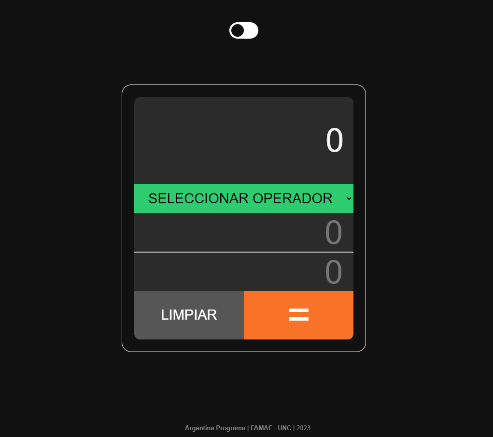
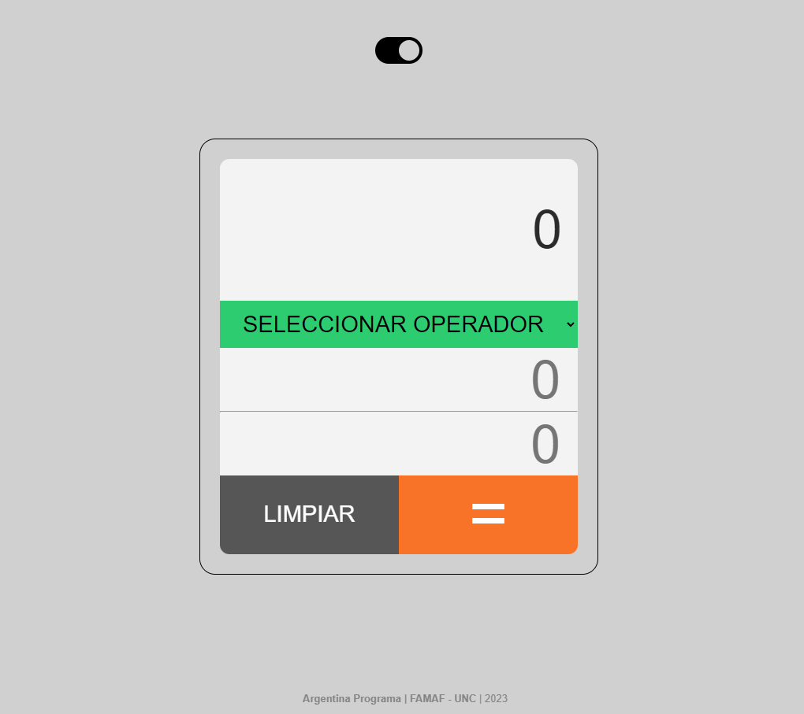

# Calculadora Simple 🧮

Una calculadora simple desarrollada como parte del Trabajo Práctico Nº1 de la formación en "Argentina Programa 4.0" dictado en 2023 por la FAMAF - UNC. | 👨‍🎓 **ALUMNO: Marcos Mingo**.

## Descripción 📝

Esta calculadora realiza las operaciones matemáticas básicas (suma, resta, multiplicación y división) y con el agregado tambien de la función "módulo". Es bastante intuitiva y sencilla de usar. Fue desarrollada utilizando HTML, CSS y JavaScript como parte de la tarea asignada en el curso de "Argentina Programa 4.0". Además cuenta con modo oscuro!.

## Capturas de Pantalla 📸

## Funcionalidades 🚀

- Permite realizar operaciones de suma, resta, multiplicación, división y módulo.
- Realiza validaciones básicas para asegurarse de que los valores ingresados sean números válidos.
- Muestra mensajes de error en caso de entradas inválidas o división por cero.

## Uso 🧐

1. **Navegar a:** https://marcosmin.github.io/calculadora-simple/
2. **Seleccionar Operación:** En color verde verás un menú desplegable con una lista de operaciones matemáticas disponibles, como "Suma", "Resta", "Multiplicación", "División" y "Módulo". Haz clic en el menú desplegable para ver las opciones y selecciona la operación que deseas realizar.
3. **Ingresar Números:** En la interfaz de la calculadora, encontrarás dos campos de entrada. Ingresa los valores numéricos en estos campos que deseas utilizar en tu operación.
4. **Calcular Resultado:** Una vez que hayas seleccionado la operación e ingresado los números, simplemente haz clic en el botón "=" de color naranja. La calculadora procesará los números y la operación seleccionada para calcular el resultado.
5. **Resultado Visible:** Después de realizar el cálculo, la calculadora mostrará el resultado en la pantalla. El resultado se presenta de manera clara y legible para que puedas ver el valor resultante de la operación.
6. **Limpiar Campos:** Una vez que hayas obtenido el resultado y desees realizar otra operación, simplemente haz clic en el botón "Limpiar" de color gris, los campos de entrada se borrarán y el resultado desaparecerá de la pantalla.
7. **Manejo de Errores:** Si ingresas valores no numéricos en los campos de entrada, si hay campos vacios o intentas realizar una división por cero, la calculadora mostrará un mensaje de error.
8. **Activar modo oscuro:** Tambien puedes activar o desactivar el modo oscuro con el switch que se encuentra arriba de la calculadora.

## Licencia 💚

**Este proyecto es de Libre Uso.** Puedes utilizar, modificar y distribuir el código de este proyecto de acuerdo a tus necesidades. No se requiere atribución ni restricciones específicas. 

## Casos de Prueba 👨‍💻

| OPERADOR       | OPERANDO 1     | OPERANDO 2     | RESULTADO ESP. | RESULTADO OBT.  |
| :------------: | :------------: | :------------: | :------------: | :------------:  |
| suma           |       2        |        2       |        4       |        4        |
| suma           |      -1        |        4       |        3       |        3        |
| resta          |       5        |        3       |        2       |        2        |
| resta          |       3        |        5       |       -2       |       -2        |
| resta          |       -3       |        6       |       -9       |       -9        |
| multiplicacion |       4        |        3       |        12      |        12       |
| multiplicacion |   10000000000  |       10       |demasiado grande| demasiado grande|
| division       |       6        |        2       |        3       |        3        |
| division       |       6        |        0       |  Error Op2 = 0 |  Error Op2 = 0  |
| sin seleccion  |     vacio      |     vacio      |      Error     |      Error      |
| sin seleccion  |       3        |       3        |selec. operador | selec. operador |
| suma           |     vacio      |     vacio      |      Error     |      Error      |
| suma           |       3        |     vacio      |      Error     |      Error      |
| suma           |     vacio      |        3       |      Error     |      Error      |
| modulo         |       6        |        5       |        1       |        1        |
| modulo         |       6        |        6       |        0       |        0        |
| modulo         |       6        |        0       |  Error Op2 = 0 |  Error Op2 = 0  |

---
Hecho con ❤️ por [Marcos Mingo](https://github.com/marcosmin) 😊